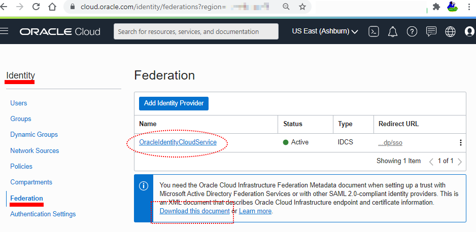

# oci-utilities - Futures

This section provides notes on possible future enhancements. A summary of all the enhancement possibilities have been raised as in GitHub

### Properties for IDCS

To connect identity management to IDCS several pieces of information are needed - two configuration values and some one off details from the IAM UI, as illustrated in the following diagram.  The file linked by the words Download this document need to be downloaded and referenced in the config file.  You also will need the URL for your IDCS instance. The name of the file will default to  *metadata.xml* and be assumed to be in the local folder.  Likewise the IDCS name will be assumed to be *OracleIdentityCloudService* as shown in the screenshot.

